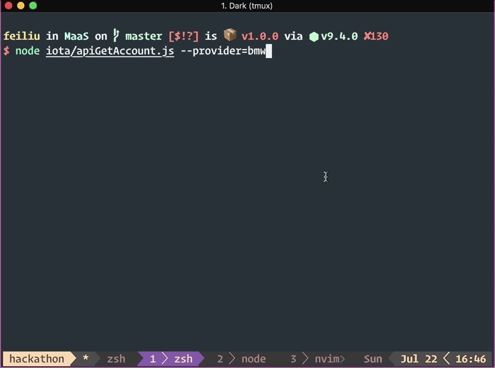
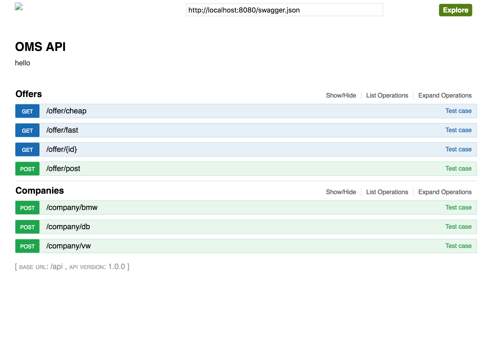

# Welcome to the repo of OMS-Mobility as a Service!

## THE TEAM

Our team consists of five passionated guy with different backgrounds.

 - Christian: originator and backend guru with SWAGGER
 - Stefan:    bridgebuilder between business & IT, with a taste of FronEnd note and a pinch of IOTA
 - Benedikt:  Stark-ish mechatronic-guy with a soft-spot for JAVA
 - Fei:       Multi-Ninja on the FrontEnd- and IOTA-side
 - Alex:      business practioneer with a passion of innovative technologies and a passion for Python 
 
 
## IDEA
We want to enable companies to enter the mobility market. Our idea is to develop a clear & crisp REST API to ease implementation on 
company and customer UI. Such way we hope more customer and mobility provider hook up in a distributed mobility ledger.

## TECHNOLOGY
We use the following technologies in pursuit of mobility happines:

 - Apache
 - Java
 - Node JS
 - React
 - IOTA JS SDK

## Demos

1. App demo -> how a user can interact with our service, e.g. finding a offer
   on IOTA from different mobile providers and conclude a contract via IOTA.

2. Get payable address of mobile provider

3. Publish mobility offer on IOTA

4. Backend Java API for mobile provider to publish offers

 
## LIBRARY

 - SWAGGER (aka OpenAPI)
 - Spring Boot
 
## TOOLS

 - IntelliJ
 - NEOVIM

## ARCHITECTURE
The Java part of this project is heavily driven by maven. There is a lot of prepossessing going on. Just to point out some steps:
1. we define our API from a business point of view, so practically we write our business login into an yaml file (api.yaml) and
2. let swagger during the maven preprocessor (compile) transform the yaml into java (by using jaxrs as a framework) code
3. how these Java files are actually created depends on swagger templates we overwrite in generator -> resources/RestGenerator, api.mustache is the place some magic happens
4. to make it even more nasty, we generate by hand a json out of your self written api.yaml. We also write it into the static folder and make it available for our frontend documentation
5. After all, our server get started in its specific sub-project, there you can also find some more REST* implementations

## FRONTENDS

## IOTA

IOTA part provides 3 APIs

1. publishing provider mobility offer to IOTA tangle net

`
node iota/apiPublish.js --payload='{"name": "fei", "test":"again1", "provider": "bmw"}'
`

2. get payable provider address for end user to conduct transaction

`
node iota/apiGetAccount.js --provider=bmw // possible providers are bmw, vw and db 
`

3. authorize and confirm payment

